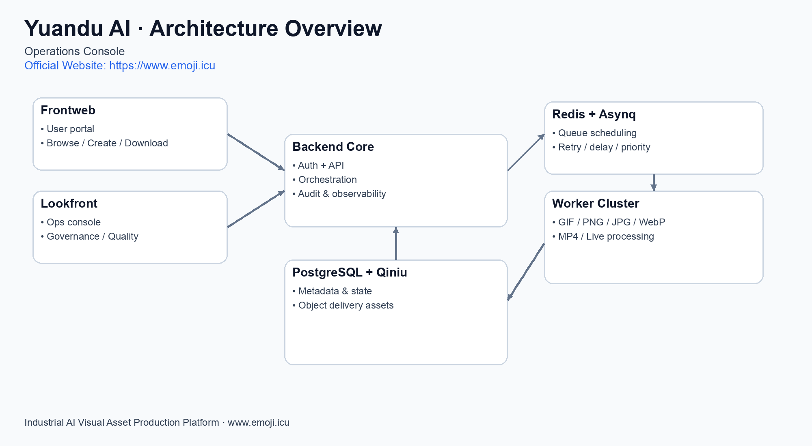
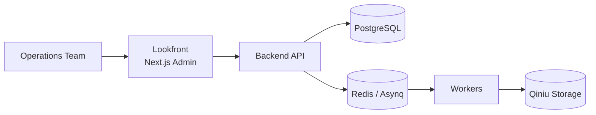
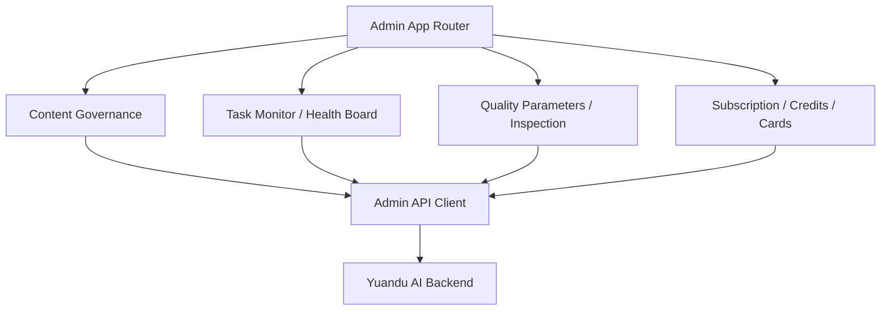

# Yuandu AI Lookfront

[](https://www.emoji.icu)


> Operations Console for AI Visual Asset Production

**Live Website:** [https://www.emoji.icu](https://www.emoji.icu)

## 1) 定位（Positioning）

本仓库是元都AI运营中台，服务运营、审核、质量与生产管理团队：

- 内容治理：素材审核、配置与运营策略管理
- 任务治理：队列巡检、状态追踪、异常定位
- 质量治理：参数调优、健康看板、结果抽检

---

## 2) 架构总览图（Architecture Overview）



---

## 3) 平台连接关系（Platform Topology）



---

## 4) 中台模块关系图（Console Modules）



---

## 5) 路线图目录（Roadmap）

| 阶段 | 方向 | 状态 |
|---|---|---|
| Phase 1 | 运营可观测（任务/健康/结果）能力完善 | ✅ In Progress |
| Phase 2 | 质量治理系统化（评分、抽检、回溯） | 🚧 In Progress |
| Phase 3 | 团队化运营能力（协作流、权限分层、审计） | 🗓️ Planned |

---

## 6) Tech Stack

- Next.js 16
- React 19
- TypeScript
- Tailwind CSS 4

---

## 7) Quick Start

```bash
npm install
cp .env.example .env.local
npm run dev
```

Default: `http://localhost:5818`

---

## 8) Environment

```bash
NEXT_PUBLIC_API_BASE=/api
```

---

## 9) Build & Run

```bash
npm run build
npm run start
```

---

## 10) Deployment

See: [`docs/DEPLOYMENT.md`](./docs/DEPLOYMENT.md)

---

## 11) License

See `LICENSE`.
